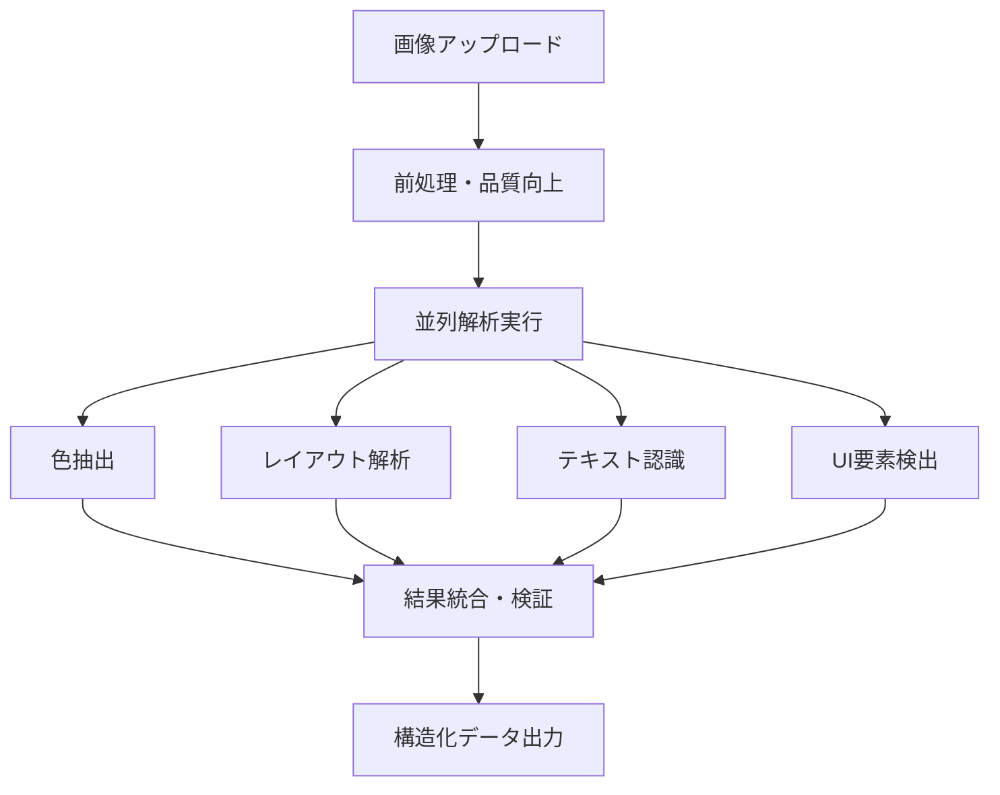
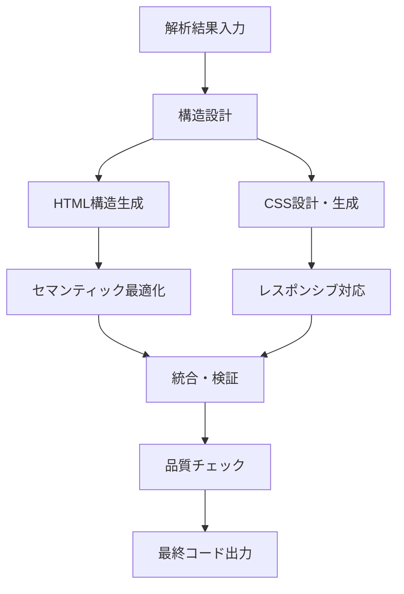
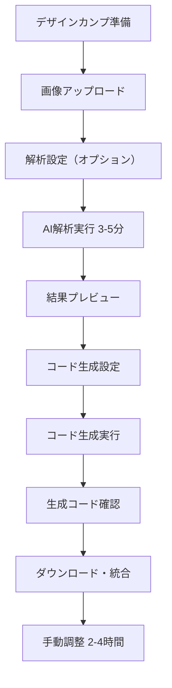

# 8割作業代替を実現する技術要件

## 目標設定

### 最終目標
- **8割作業代替**: スキルを持ったコーダーの作業時間を80%削減
- **品質基準**: Web AI（Claude、GPT-4V）に近い精度（100%は求めない）
- **対象ユーザー**: プロのコーダーが仕上げることを前提
- **商業価値**: Phase 2完了時点で収益化可能な品質

### 作業時間削減の具体例
```
従来フロー: 13-20時間
- デザインカンプ確認: 30分
- 構造解析・設計: 2-3時間
- HTML構造作成: 3-4時間  
- CSS実装: 4-6時間
- レスポンシブ対応: 2-3時間
- 調整・デバッグ: 2-4時間

8割代替後: 3-5時間 (70-80%削減)
- 画像アップロード: 2分
- AI解析・コード生成: 3-5分
- 生成コードの確認: 30分
- 細部調整・カスタマイズ: 2-4時間
- 最終チェック: 30分
```

## Phase別実装計画

### Phase 1: 基盤構築（2-4週間）
**目標**: 基本的な画像解析の動作確認
**再現度**: 45-60%

#### 実装内容
1. **環境問題修正**: Renderer プロセスでの画像解析実行
2. **基本解析機能**: 色抽出、レイアウト、テキスト認識の正常動作
3. **コード生成改善**: 解析結果の活用

#### 成果物
- 動作する画像解析システム
- 基本的なHTML/CSS生成
- β版としての検証準備

### Phase 2: 商用化品質（1-2ヶ月）
**目標**: 8割作業代替の実現
**再現度**: 65-75%

#### 実装内容
1. **高精度解析エンジン**: 下記の詳細仕様
2. **UI要素検出**: ボタン、フォーム、ナビゲーション等
3. **品質保証システム**: 自動検証・修正
4. **ワークフロー最適化**: ユーザビリティ向上

#### 成果物
- 商用レベルの画像解析
- プロダクション品質のコード生成
- 収益化可能なアプリケーション

## 技術スタック要件

### 1. 画像解析エンジン

#### 必要な解析機能
```javascript
const requiredAnalysisCapabilities = {
  // 基本解析（Phase 1）
  colorExtraction: {
    precision: '主要5-8色の正確な抽出',
    colorTheory: '配色理論の適用（補色、類似色等）',
    accessibility: 'コントラスト比の自動チェック'
  },
  
  layoutAnalysis: {
    structureDetection: 'ヘッダー/メイン/フッターの識別',
    gridDetection: '2-3カラムレイアウトの認識',
    spacingAnalysis: 'マージン・パディングの推定'
  },
  
  textRecognition: {
    ocrAccuracy: '90%以上の文字認識精度',
    positionDetection: 'テキスト要素の正確な位置',
    hierarchyAnalysis: 'H1-H6、本文の階層判定'
  },
  
  // 高度解析（Phase 2）
  uiComponentDetection: {
    buttonDetection: 'ボタン要素の形状・スタイル認識',
    formDetection: '入力フィールド・フォームの識別',
    navigationDetection: 'メニュー・ナビゲーションの認識',
    cardDetection: 'カード型レイアウトの識別'
  },
  
  responsiveAnalysis: {
    breakpointEstimation: 'レスポンシブ切り替え点の推定',
    mobileLayout: 'モバイル表示での要素配置予測'
  }
};
```

#### 技術選択
```javascript
const techStack = {
  imageProcessing: {
    primary: 'OpenCV.js (ブラウザ版)',
    environment: 'Renderer プロセス',
    features: ['エッジ検出', '輪郭抽出', '色空間変換']
  },
  
  textRecognition: {
    primary: 'Tesseract.js v6.0.0',
    languages: ['jpn', 'eng'],
    accuracy: '90%+ (前処理最適化)'
  },
  
  enhancement: {
    preprocessing: '画像品質向上処理',
    multiResolution: '複数解像度での解析',
    resultFusion: '解析結果の統合・検証'
  }
};
```

### 2. コード生成エンジン

#### 生成品質要件
```javascript
const codeQualityRequirements = {
  html: {
    semantic: 'セマンティックなHTML5構造',
    accessibility: 'WAI-ARIA対応、適切なalt属性',
    seo: 'SEOに配慮したマークアップ',
    validation: 'W3C準拠、エラーなし'
  },
  
  css: {
    methodology: 'BEM記法またはCSS Modules',
    responsive: 'モバイルファースト、Flexbox/Grid使用',
    performance: '最適化されたセレクタ、最小限のコード',
    maintenance: '保守性重視、コメント付き'
  },
  
  frameworks: {
    vanilla: 'プレーンHTML/CSS',
    react: 'Reactコンポーネント',
    vue: 'Vueコンポーネント',
    typescript: 'TypeScript対応'
  }
};
```

#### 実装アーキテクチャ
```javascript
class ProductionCodeGenerator {
  async generateCode(analysisResult, userPreferences) {
    // 1. 構造設計
    const structure = await this.designStructure(analysisResult);
    
    // 2. HTML生成
    const html = await this.generateSemanticHTML(structure);
    
    // 3. CSS生成
    const css = await this.generateOptimizedCSS(structure, analysisResult);
    
    // 4. 品質保証
    const validated = await this.validateAndOptimize(html, css);
    
    return validated;
  }
}
```

### 3. 品質保証システム

#### 自動検証機能
```javascript
const qualityAssurance = {
  validation: {
    htmlValidation: 'W3C Markup Validator相当',
    cssValidation: 'W3C CSS Validator相当',
    accessibilityCheck: 'WCAG 2.1 AA準拠チェック',
    responsiveTest: 'ブレークポイント動作確認'
  },
  
  optimization: {
    codeMinification: '本番用の最適化',
    performanceCheck: 'Core Web Vitals対応',
    crossBrowserTest: 'ブラウザ互換性確認'
  },
  
  autoFix: {
    commonIssues: '一般的な問題の自動修正',
    standardCompliance: '標準準拠への自動調整',
    bestPractices: 'ベストプラクティスの適用'
  }
};
```

## 実装フロー

### 1. 画像解析フロー


### 2. コード生成フロー


### 3. ユーザーワークフロー


## アーキテクチャ設計

### 実行環境
```javascript
const executionEnvironment = {
  imageAnalysis: {
    process: 'Renderer プロセス',
    reason: 'OpenCV.js、Tesseract.jsの正常動作',
    libraries: ['webassembly-image-analyzer.js', 'imagePreprocessor.js']
  },
  
  codeGeneration: {
    process: 'Main プロセス', 
    reason: 'ファイルシステムアクセス、AIプロンプト生成',
    libraries: ['promptGenerator.js', 'codeGenerator.js']
  },
  
  communication: {
    method: 'IPC (Inter-Process Communication)',
    format: '構造化JSON',
    validation: 'スキーマ検証'
  }
};
```

### データフロー
```javascript
const dataFlow = {
  input: 'デザインカンプ画像（Base64）',
  
  analysis: {
    colors: '色情報配列（HEX、RGB、役割）',
    layout: 'レイアウト構造（グリッド、セクション）',
    text: 'テキスト要素（内容、位置、階層）',
    components: 'UI要素（タイプ、位置、プロパティ）'
  },
  
  generation: {
    html: 'セマンティックHTML構造',
    css: '最適化されたCSS',
    assets: '画像・アイコン等のアセット情報'
  },
  
  output: '即座に使用可能なWebサイトコード'
};
```

## 成功指標（KPI）

### Phase 1 完了指標
- **解析成功率**: 95%以上
- **色抽出精度**: 90%以上  
- **基本レイアウト認識**: 85%以上
- **生成コード実行可能率**: 100%

### Phase 2 完了指標（8割代替実現）
- **総合再現度**: 70%以上
- **作業時間削減**: 75%以上
- **UI要素検出精度**: 80%以上
- **ユーザー満足度**: 80%以上

### 商用化判断指標
- **継続使用率**: 60%以上
- **推奨度（NPS）**: 50以上
- **平均処理時間**: 5分以内
- **エラー率**: 5%未満

## 技術的制約・リスク

### 制約事項
1. **ブラウザ環境の制限**: メモリ・CPU制約
2. **オフライン動作**: インターネット接続不要
3. **プライバシー**: 画像データの外部送信なし
4. **クロスプラットフォーム**: Windows/Mac/Linux対応

### リスク対策
1. **パフォーマンス**: ローディング最適化、段階的処理
2. **精度向上**: ユーザーフィードバックによる学習機能
3. **保守性**: モジュール化設計、自動テスト
4. **スケーラビリティ**: 将来的なクラウド連携準備

## 次期フェーズ（Phase 3以降）

### 高度機能
- **学習機能**: ユーザー修正からの継続学習
- **テンプレート**: 業界特化テンプレート
- **API提供**: 外部ツール連携
- **チーム機能**: 複数人での共同作業

### 市場展開
- **エンタープライズ**: 大手制作会社向け
- **教育市場**: プログラミングスクール連携
- **国際展開**: 多言語対応

---

*このドキュメントは、8割作業代替を実現するための技術要件を定義しています。Phase 2完了時点で商用化可能な品質を目指します。*